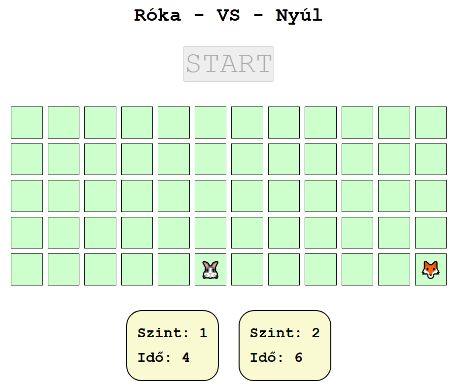

# Róka és Nyúl

Készíts egy játékot, amelyben egy róka karaktert irányítunk, és az a célunk, hogy elkapjunk egy ugráló nyulat!

<p align="center">
  
</p>

*A megoldás során nem szükséges pontosan a mintát követni. A **leírásnak megfelelő** bármilyen megjelenítés elfogadható.*

## Játék kezdete

1. A játék egy **gombra kattintva induljon** el. A játék végét követően új játék is legyen indítható ugyanazzal a gombbal, de miközben játszunk a gomb ne legyen használható. **`1p`**

2. A **játéktér** egy **táblázat**, amelynek `n` sora és `m` oszlopa van. Ezeket rögzítheted konstansként.
   
    Kezdetben a róka fixen a jobb alsó sarokban helyezkedik el, a nyúl pedig egy véletlenszerű helyen, de mindenképpen a táblázat bal oldalán jelenik meg. **`2p`**

    A róka és a nyúl aktuális pozícióját egy-egy objektumban tárold. Pl.:
    ```js
    const fox = { x: n-1, y: m-1 }; // x: sor, y: oszlop
    ```

3. Egy szint kezdetekor a karakterek megjelenését követően **tudjuk irányítani a rókát**. A kurzor billentyűk lenyomására (`keydown`) mozduljon el a megfelelő irányba! Ügyelj rá, hogy ne tudjon a táblázaton kívülre jutni! **`2p`**

## Szintek

A róka akkor nyer, ha sikerül 3-szor elkapnia a nyulat. Mindegyik alkalommal 7 másodperce van erre. *A szintek tehát nehézségben nem különböznek egymástól, csak 3-szor egymás után kell ugyanazt teljesítenie a játékosnak.*

4. Készíts függvényt `level` néven, amely a játék egy szintjét szimulálja. A függvényen belül oldd meg, hogy a nyúl **1 másodpercenként új hely**re ugorjon! **`2p`**

    Az új hely teljesen véletlenszerű lehet a táblázaton belül, akár még oda is ugorhat, ahol éppen a róka van.

5. Jelenítsd meg a felhasználó számára a weboldalon az idő **pontos** múlását másodpercben! Az eltelt időt a UNIX timestamp segítségével számítsd ki a szint kezdetétől számolva! **`3p`**
   
    Ha eltelik 7 másodperc, akkor érjen véget a szint! A szint végét követően a rókát ne tudjuk irányítani, és tűnjön is el a játéktérről!

6. A `level` függvény visszatérési értéke egy `Promise` objektum legyen, amely addig van `pending` állapotban, amíg a róka üldözi a nyulat. Ha sikerül elkapnia 7 másodpercen belül, akkor beteljesül az ígéret (`fulfilled`), viszont ha lejár az idő, akkor elutasításra kerül (`rejected`). **`3p`**

    A `Promise` **elfogadó állapot**ban az **időt adja** vissza (amennyi alatt a szintet teljesítettük), **elutasítás esetén** pedig a **szintet** (amelyiket elbuktuk).

    *Érdemes a `level` függvénynek paraméterként átadni az aktuális szint sorszámát meghíváskor.*

7. Az 1. szint teljesítése esetén következzen a 2. szint, majd a 3. szint. Ha bármelyik szinten nem sikerül a rókának elkapnia a nyulat, akkor véget ér a játék! Akár győztünk, akár veszítettük, a start gomb segítségével mindenképpen indíthassunk új játékot! **`3p`**

## Megjelenítés

8. Egy-egy játék közben láthassuk folyamatosan, hogy az **eddigi szintek mennyi idő**t vettek igénybe. **`2p`**

9. Törekedj a **szép megjelenítés**re, az oldal kinézete ne legyen hanyag! **`2p`**

**Összesen: 20 pont**